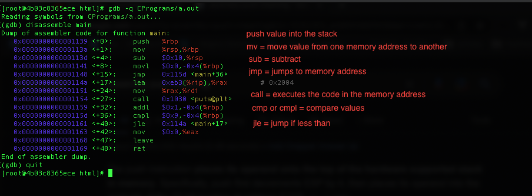

# Debug of C code with Assembly

Gustavo Morais, at Arch Linux

### Install required for Arch Linux
```
pacman -Sy gdb --noconfirm, this is the gdb memory debug

pacman -Sy pwndbg --noconfirm

echo 'source /usr/share/pwndbg/gdbinit.py' >> ~/.gdbinit

pacman -Sy gcc --noconfirm

pacman -Sy nano --noconfirm
```

### Compile C program with debug simbols
```
gcc -g CPrograms/first.c
```

### dump assembly code of C program
```

objdump -D CPrograms/a.out // dump everything

objdump -D CPrograms/a.out | grep -A20 main.: // dump the main function

```

### Debug with gdb
```
gdb -q CPrograms/a.out

(gdb) list // the list command

(gdb) disassemble main // shows the assembly code of the main function

(gdb) quit
```


